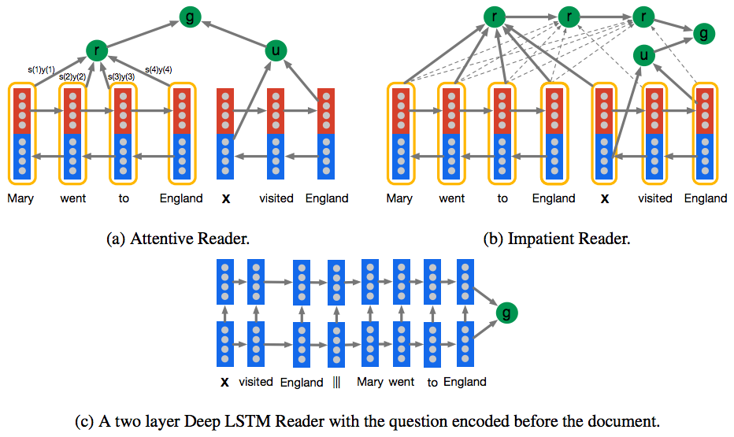

Attentive Reader
================

Tensorflow implementation of Google DeepMind's [Teaching Machines to Read and Comprehend](http://arxiv.org/pdf/1506.03340v3.pdf). This code contains:

1. A two layer Deep LSTM Reader
    - with [skip connections](http://arxiv.org/pdf/1308.0850.pdf) from the inputs to all hidden layers
    - with [peephole weights](http://www.jmlr.org/papers/volume3/gers02a/gers02a.pdf) that provide precise timing
2. Attentive Reader
    - with [Bidirectional LSTMs](ftp://ftp.idsia.ch/pub/juergen/nn_2005.pdf) with peephole weights
3. Impatient Reader
    - with [Bidirectional LSTMs](ftp://ftp.idsia.ch/pub/juergen/nn_2005.pdf) with peephole weights
    - with recurrent accumulation of information from the document while reading the query

Prerequisites
-------------

- Python 2.7 or Python 3.3+
- [Tensorflow](https://www.tensorflow.org/)

Usage
-----

First, you need to download [DeepMind Q&A Dataset](https://github.com/deepmind/rc-data) from [here](http://cs.nyu.edu/~kcho/DMQA/), save `cnn.tgz` and `dailymail.tgz` into the repo, and run:

    $ ./unzip.sh cnn.tgz dailymail.tgz

Then run the pre-processing code with:
    $ python data_utils.py data cnn

To train a model with `cnn` dataset:

    $ python main.py --dataset cnn --is_train True

To test an existing model:

    $ python main.py --dataset cnn

(in progress)

Author
------

Taehoon Kim / [@carpedm20](http://carpedm20.github.io/)
